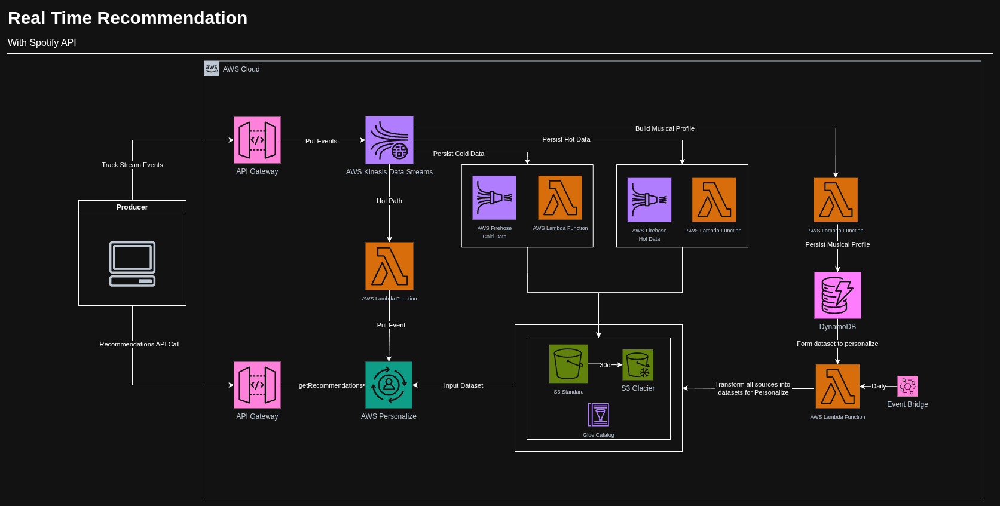

# Real-Time Music Recommendation (Serverless + Amazon Personalize)

## Overview

This project is a **serverless real-time recommendation system** that:

- Captures the user’s **current track on Spotify**.
- Builds a **musical profile** for each user (genres, artists, audio features).
- Uses **Amazon Personalize** to recommend new songs based on:
  - recent listening behavior (interactions), and  
  - long-term musical taste (user profile).

The goal is to demonstrate how to build a scalable, low-latency recommendation system using serverless AWS services and Amazon Personalize.

---

## Architecture

At a high level, the system is split into three main parts:

1. **Producer**
2. **Processor**
3. **Recommender**

### 1. Producer

- Local script/app using **Spotify API (Spotipy)**.
- Tracks the current user playback (play, skip, complete, etc.).
- Sends normalized events to an **ingestion API (API Gateway)** in near real time.

### 2. Processor

- **API Gateway → Kinesis Data Streams**  
  Central entry point for all track events.

- **Hot Path (Real Time)**
  - **Lambda (Hot Path)** consumes from Kinesis.
  - Sends interaction events to **Amazon Personalize** using `PutEvents`
    so the model can react quickly to new behavior.

- **Cold Path (Data Lake)**
  - **Kinesis Firehose** writes raw and/or transformed events to **S3**.
  - **Glue Catalog** exposes this data for analytics (Athena, etc.).
  - **Lifecycle rules** move old data to **S3 Glacier**.

- **User Musical Profile**
  - Another consumer builds an aggregated **musical profile per user**  
    (favorite genres, artists, average audio features, recent history).
  - Profiles are stored in **DynamoDB**, one item per `user_id`.

- **Batch Dataset Builder (Daily)**
  - **EventBridge** triggers a daily **Lambda** that:
    - Reads user profiles from **DynamoDB**.
    - Reads interaction history from **S3**.
    - Generates the three **Amazon Personalize datasets** in S3:
      - Interactions (what the user listened to and when),
      - Users (features derived from the musical profile),
      - Items (Spotify songs dataset from Kaggle).
    - Starts **dataset import jobs** to keep Personalize up to date.

### 3. Recommender

- **API Gateway – Recommendations**
  - Public endpoint, e.g. `GET /recommendations?user_id=...`.

- **Lambda – Recommendation Service**
  - Calls **Amazon Personalize Runtime (`GetRecommendations`)** using the active campaign.
  - Returns a ranked list of `track_id`s that should match the user’s musical taste.

---

## Amazon Personalize

Amazon Personalize is used as the managed recommendation engine.

Datasets:

- **INTERACTIONS**  
  - User–Item events from the streaming pipeline.

- **ITEMS**  
  - Spotify tracks metadata (Kaggle dataset: artist, genre, danceability, energy, etc.).

- **USERS**  
  - Features derived from the DynamoDB musical profile (favorite genre, average audio profile, counts, etc.).

Resources:

- **Dataset Group** with Interactions, Items and Users.
- **Event Tracker** for real-time `PutEvents`.
- **Solution & Solution Version** using a user-personalization recipe.
- **Campaign** serving real-time recommendations via `GetRecommendations`.

---

## Tech Stack

- **AWS**: API Gateway, Kinesis Data Streams, Kinesis Firehose, Lambda, DynamoDB, S3, Glue, S3 Glacier, EventBridge, Amazon Personalize.
- **Spotify**: Spotipy (Python client).
- **Languages**: Python ( Lambdas & producer ), Terraform/SST (infrastructure as code – planned).

### **This project is on current development!**